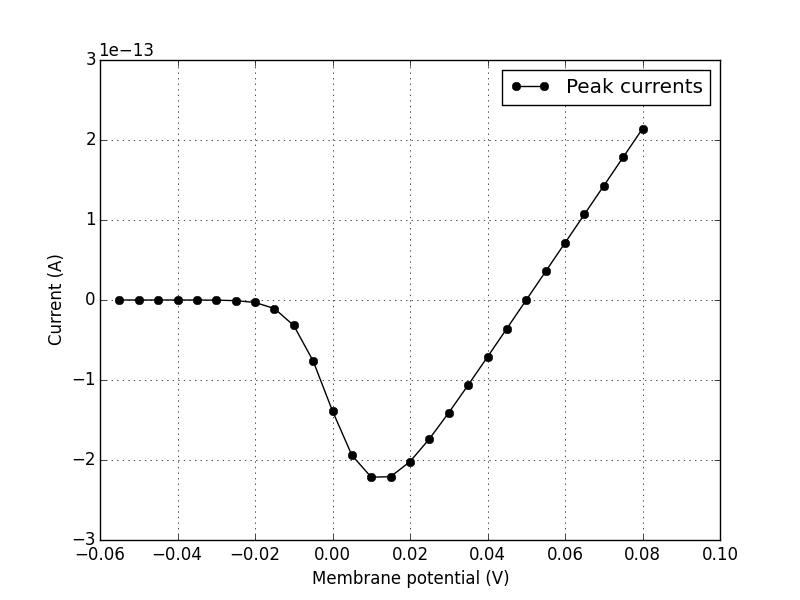

# ChannelWorm scripts

## `iv_curve_from_model.py`

The main line of code in this script is a `subprocess` call to do:

```
pynml-channelanalysis -temperature 34   -minV -55  -maxV 80  \
-duration 600 -clampBaseVoltage -55  -clampDuration 580  \
-stepTargetVoltage 10  -erev 50  -caConc 0.001 -clampDuration 600 \
-stepTargetVoltage 5 -ivCurve Kv1.channel.nml
```

This is calling pyNeuroML to generate a current voltage relationship (`-ivCurve` option).

The target channel is the last argument here: `Kv1.channel.nml`.

The rest of the arguments are specifying parameters for the simulation, such as temperature, length of clamping, etc.

You will get a number of generated output files. One example should look like this I/V curve:


